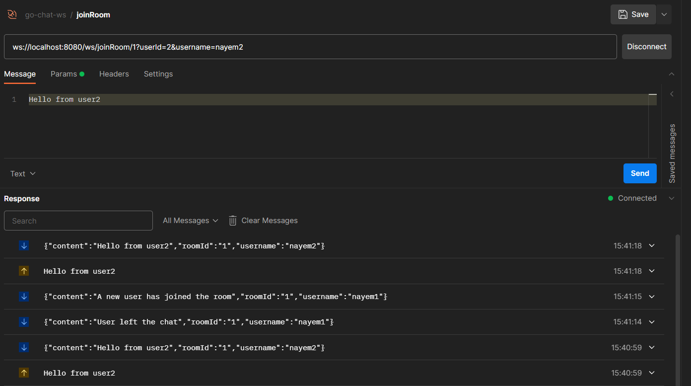
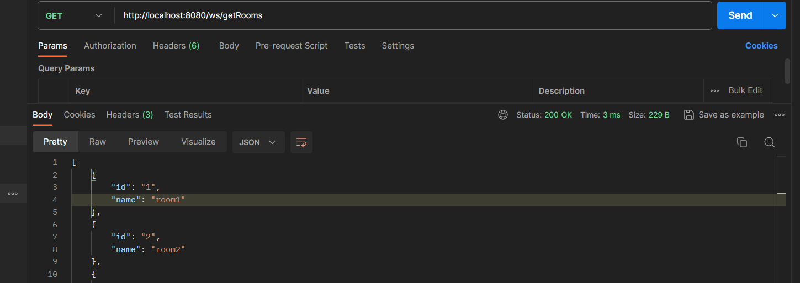
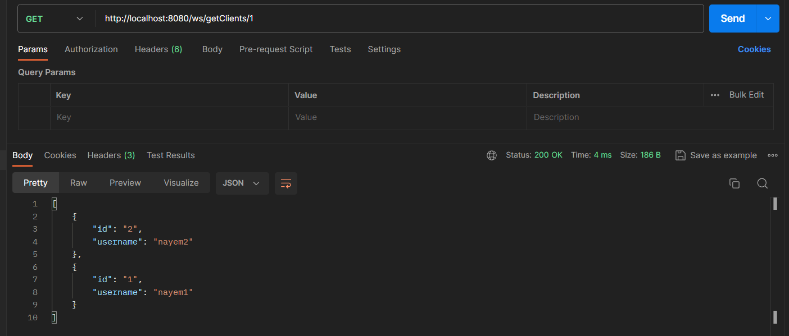
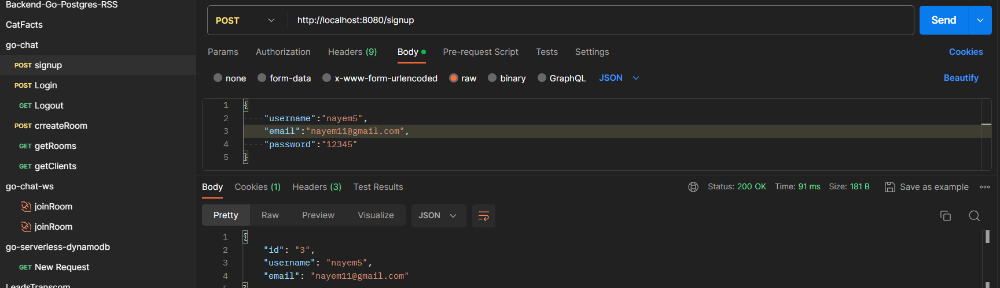
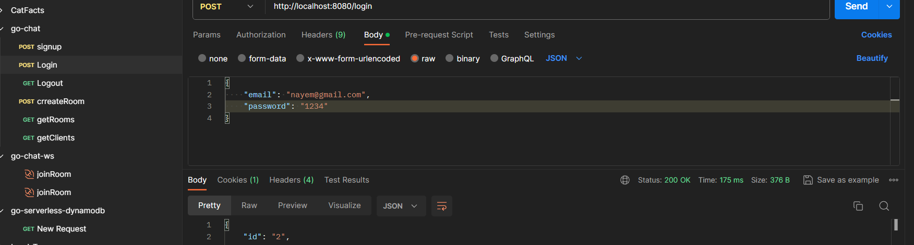
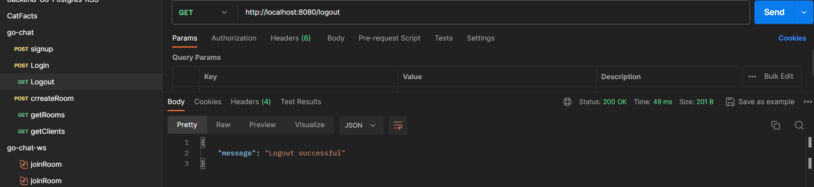

# Real-time Chat Application

Welcome to the Real-time Chat Application series! This series guides you through building a chat application using Go for the backend and Next.js with TypeScript for the frontend.

## v3.0: Frontend UI Development

- Third part of the series focusing on the frontend UI.
- Utilizes Next.js, TypeScript, and TailwindCSS for the frontend.
- Enhance your understanding of building an engaging user interface.

## v2.0: WebSocket and Room Management

- Continuation of the chat application series with Go.
- Creation of endpoints for establishing a websocket connection.
- Implementation of features to create a room, get rooms, and get clients in the room.

## v1.0: Backend Setup and Authentication

- Building the backend with Go.
- Creation of endpoints for sign up, login, and log out.
- Implementation of a clean architecture approach.

